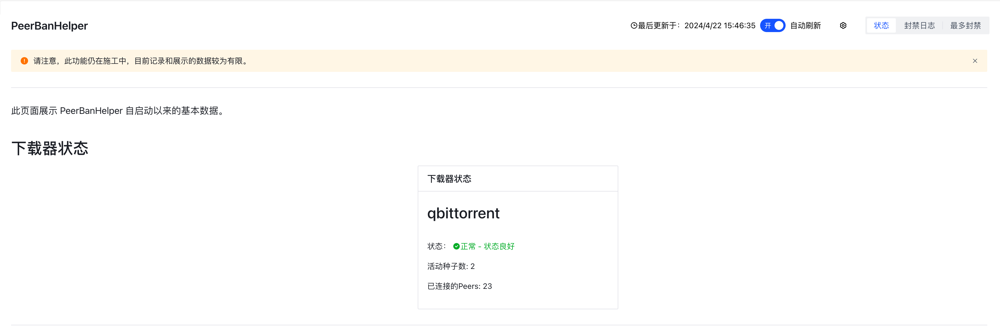
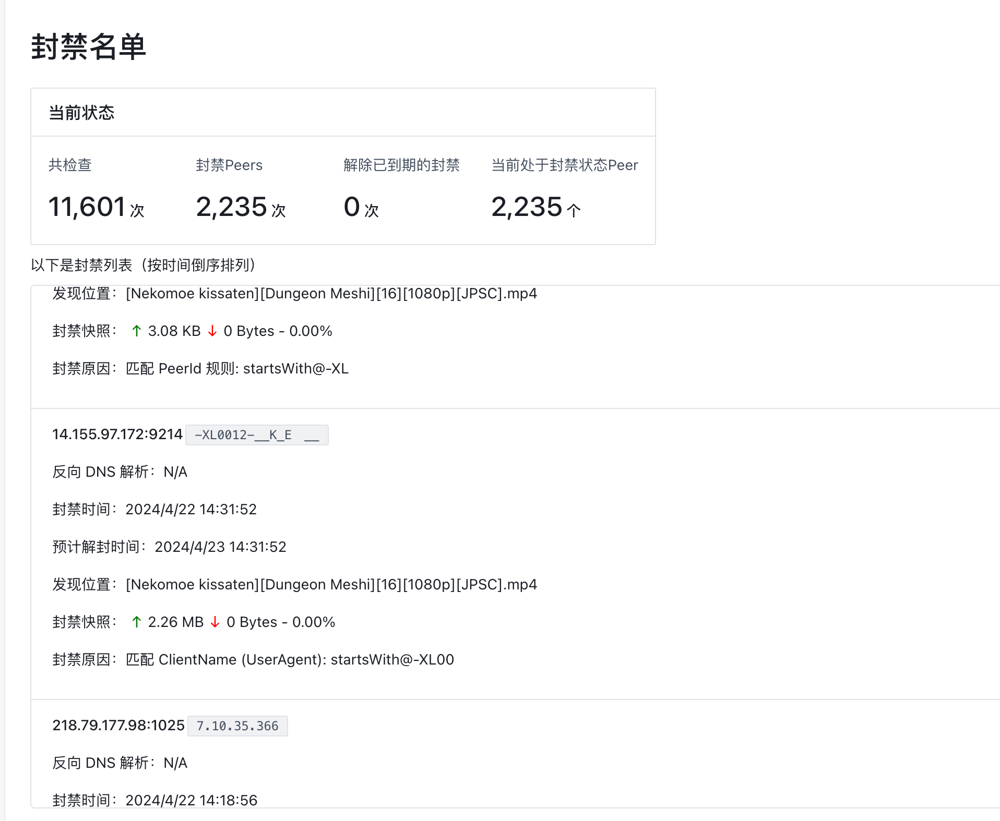
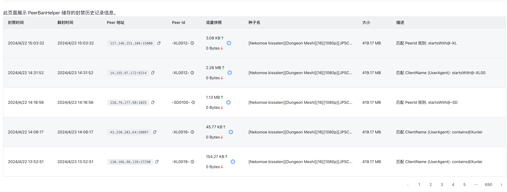
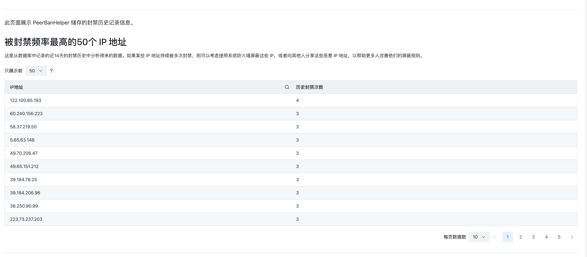

# pbh-fe

This is a ~alternative~ WebUI of the [PeerBanHelper](https://github.com/Ghost-chu/PeerBanHelper), based on modern front-end stacks.

Quick preview: https://pbh.u2b.eu

API Doc: https://apifox.com/apidoc/shared-b24f42a4-67f5-402a-900d-9fad3ae9917b

## Feature

- [x] Custom Endpoint
- [x] Ban List
- [x] Ban Logs
- [x] Auto Refresh
- [x] Client Status
- [x] Max-ban list with search
- [x] Manage rule subscription

## Screenshots






## How to contribute

This project using Vue 3 + [Arco Design](https://arco.design/vue/en-US/docs/start)

## Project Setup

You are supposed to use [pnpm](https://pnpm.io/) to manage the dependencies.

```sh
pnpm install
```

### Compile and Hot-Reload for Development

```sh
pnpm run dev
```

### Type-Check, Compile and Minify for Production

```sh
pnpm run build
```

### Lint with [ESLint](https://eslint.org/)

```sh
pnpm run lint
```
